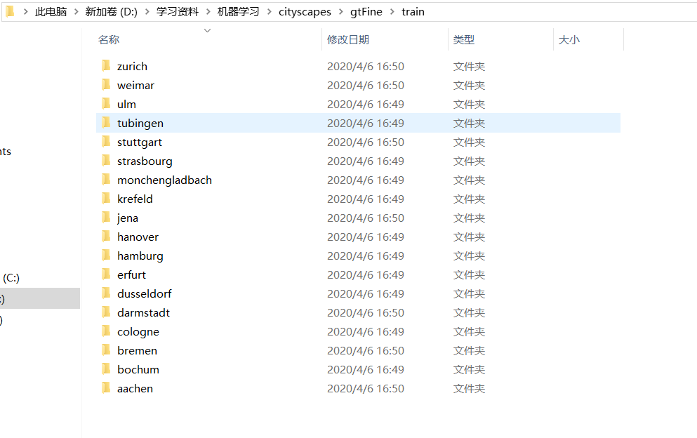
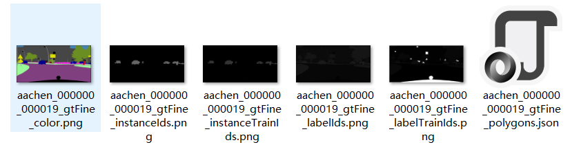
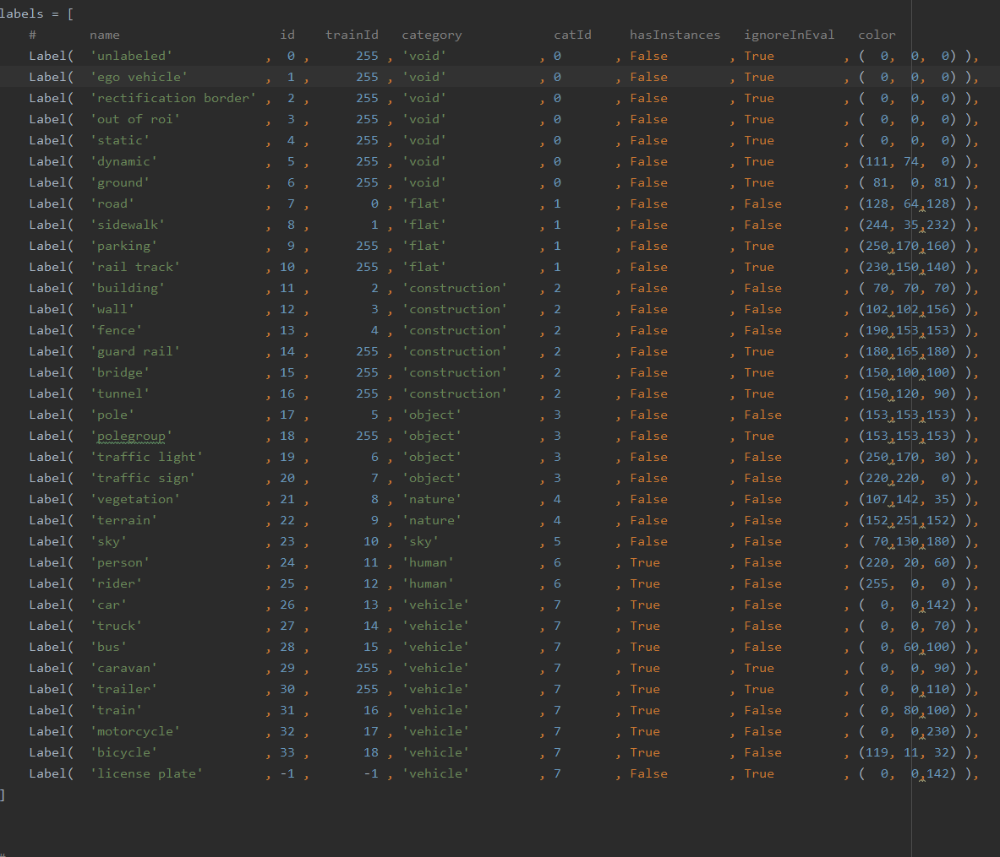

# cityspace数据集简介

cityspace数据集来自链接：https://pan.baidu.com/s/1kC3Ogfex_Rx_L8TnO5CAzQ 
提取码：6l9y

数据集总共分为两个大目录分别是`leftImg8bit`,`gtFine`

#### leftImg8bit文件夹

该文件夹下图片为RGB彩色图即原图

有test val train 三个文件夹的数据集，分别用做测试，验证和训练。

> 训练集共2975张（train)，验证集500张（val)，都有相应的精细标注的标签。但是，测试集(test)只给了原图，没有给标签，官方用于线上评估大家提交的代码（防止有人用test集训练刷指标）

以train文件夹为例



每个文件夹都以城市命名其下图片均是来自行车记录仪中所拍摄画面，但是并不是连续的帧。

命名规则节选

>在leftImg8bit/train下有18个子文件夹对应德国的16个城市，法国一个城市和瑞士一个城市：
>
>亚琛 (aachen)（174 items, totalling 379.4 MB）、波鸿（bochum）（96 items, totalling 239.2 MB）、不莱梅（bremen）（316 items, totalling 734.0 MB）、科隆（cologne）（154 items, totalling 355.0 MB）、达姆施塔特(darmstadt)（85 items, totalling 196.4 MB）、杜塞尔多夫（dusseldorf）（221 items, totalling 480.3 MB）、埃尔福特（erfurt）（109 items, totalling 234.5 MB）、汉堡（hamburg）（248 items, totalling 617.4 MB）、汉诺威（hannover）（196 items, totalling 466.8 MB）、耶拿（jena）（119 items, totalling 270.3 MB）、克雷费尔德(krefeld)（99 items, totalling 227.0 MB）、门兴格拉德巴赫（monchengladbach）（94 items, totalling 214.9 MB）、斯特拉斯堡 （strasbourg）（法国）（365 items, totalling 866.5 MB）、斯图加特（stuttgart）（196 items, totalling 457.8 MB）、图宾根 (tübingen)（144 items, totalling 359.8 MB）、乌尔姆（ulm）（95 items, totalling 216.7 MB）、魏玛（weimar)（142 items, totalling 338.7 MB）、苏黎世（zurich）（瑞士）（122 items, totalling 291.4 MB）
>
>里面图片的命名规则是：用_将名字分割成四部分，其中第一部分的设定是该文件夹的名字,第四部分都是leftImg8bit.png，第二部分和第三部分都是六位数字。
>
>aachen：aachen_000000_000019_leftImg8bit.png,第二部分从000000到000173对应174张图片，第三部分固定是000019
>
>bochum：bochum_000000_000313_leftImg8bit.png,第二部分固定000000，第三部分不固定没有规则的六位数
>
>bremen：bremen_000000_000019_leftImg8bit.png,第二部分从000000到000315对应316张图片，第三部分固定000019
>
>cologne：cologne_000000_000019_leftImg8bit.png,第二部分从000000到000153对应154张图片，第三部分固定000019
>
>darmstadt：darmstadt_000000_000019_leftImg8bit.png,第二部分从000000到000084对应85张图片，第三部分固定000019
>
>dusseldorf：dusseldorf_000000_000019_leftImg8bit.png,第二部分从000000到000221对应222张图片，第三部分固定000019
>
>erfurt：erfurt_000000_000019_leftImg8bit.png，第二部分从000000到000108对应109张图片，第三部分固定000019
>
>hamburg：hamburg_000000_000042_leftImg8bit.png，第二部分固定000000，第三部分不固定
>
>hannover：hannover_000000_000164_leftImg8bit.png，第二部分固定000000，第三部分不固定
>
>jena：jena_000000_000019_leftImg8bit.png，第二部分从000000到000118对应119张图片，第三部分固定000019
>
>krefeld：krefeld_000000_000108_leftImg8bit.png，第二部分固定000000，第三部分不固定
>
>monchengladbach：monchengladbach_000000_000076_leftImg8bit.png,第二部分固定000000（86张）和000001（8张），第二部分不固定
>
>strasbourg：strasbourg_000000_000065_leftImg8bit.png,第二部分固定000000（144张）和000001（221张），第二部分不固定
>
>stuttgart：stuttgart_000000_000019_leftImg8bit.png，第二部分从000000到000195对应196张图片，第三部分固定000019
>
>tübingen：tübingen_000000_000019_leftImg8bit.png，第二部分从000000到000143对应144张图片，第三部分固定000019
>
>ulm：ulm_000000_000019_leftImg8bit.png，第二部分从000000到000094对应95张图片，第三部分固定000019
>
>weimar：weima_000000_000019_leftImg8bit.png，第二部分从000000到0000141对应142张图片，第三部分固定000019
>
>zurich：zurich_000000_000019_leftImg8bit.png，第二部分从000000到0000121对应122张图片，第三部分固定000019
>
>train集总共有2975张png格式的大小为2048 x 1024的0-255的RGB图片
>
>在leftImg8bit/val下有3个子文件夹对应德国的3个城市：
>
>法兰克福（frankfurt）（267 items, totalling 644.2 MB）、林道（lindau）（59 items, totalling 139.5 MB）、明斯特（munster）（174 items, totalling 397.7 MB）
>
>里面图片的命名规则是：用_将名字分割成四部分，其中第一部分的设定是该文件夹的名字,第四部分都是leftImg8bit.png，第二部分和第三部分都是六位数字。
>
>frankfurt：frankfurt_000000_000294_leftImg8bit.png,第二部分固定000000（51张）和000001（216张），第二部分不固定
>
> lindau：lindau_000000_000019_leftImg8bit.png，第二部分从000000到0000058对应59张图片，第三部分固定000019
>
>munster：munster_000000_000019_leftImg8bit.png，第二部分从000000到0000173对应174张图片，第三部分固定000019
>
>val集总共有500张png格式的大小为2048 x 1024的0-255的RGB图片
>
>在leftImg8bit/test下有6个子文件夹对应德国的6个城市：
>
>柏林（berlin）（544 items, totalling 1.2 GB）、比勒费尔德（bielefeld）（181 items, totalling 414.1 MB）、波恩（bonn）（46 items, totalling 102.9 MB）、勒沃库森（leverkusen）（58 items, totalling 136.9 MB）、美因茨（mainz）（298 items, totalling 679.2 MB）、慕尼黑（münchen）（398 items, totalling 927.4 MB）
>
>里面图片的命名规则是：用_将名字分割成四部分，其中第一部分的设定是该文件夹的名字,第四部分都是leftImg8bit.png，第二部分和第三部分都是六位数字。
>
>berlin：berlin_000000_000019_leftImg8bit.png，第二部分从000000到000543对应544张图片，第三部分固定000019
>
>bielefeld：bielefeld_000000_000108_leftImg8bit.png，第二部分固定000000，第三部分不固定
>
> bonn：bonn_000000_000019_leftImg8bit.png，第二部分从000000到000045对应46张图片，第三部分固定000019
>
>leverkusen：leverkusen_000000_000019_leftImg8bit.png，第二部分从000000到000057对应58张图片，第三部分固定000019
>
>mainz：mainz_000000_000093_leftImg8bit.png,第二部分固定000000（72张）、000001（165张）、000002（7张）和000003（54张），第二部分不固定
>
>münchen：münchen_000000_000019_leftImg8bit.png，第二部分从000000到000397对应398张图片，第三部分固定000019
>
>test集总共有1525张png格式的大小为2048 x 1024的0-255的RGB图片
>————————————————
>版权声明：本文为CSDN博主「一只tobey」的原创文章，遵循 CC 4.0 BY-SA 版权协议，转载请附上原文出处链接及本声明。
>原文链接：https://blog.csdn.net/zz2230633069/article/details/84591532


#### gtFine文件夹

该文件存放的是图片的mask和json标注，每个图片文件对一个6个标注文件分别是



1. aachen_000000_000019_gtFine_color.png:掩码的color色彩图，每个类别被标注了不同的颜色
2. aachen_000000_000019_gtFine_instanceIds.png：用于实例分割 实例ID掩码图。最完整的标注，每个实例被标注了instance id，其中如果某个实例有多个，比如多辆车，车的ID是26的话，每辆车的标注是2600X，X是实例编号，也就是第0,1,2,3,4,5...辆车。用的时候，通过整除1000得到labelID，通过对1000取余，得到实例编号。
3. aachen_000000_000019_gtFine_instanceTrainIds.png:用于实例分割，训练用实例Id掩码图。属于实例ID掩码图的阉割版，通过人为指定不想要识别的实例的标注ID为255，重新排列想要识别的ID编号得到
4. aachen_000000_000019_gtFine_labelIds：标签ID图，用于语义分割，同一类实例ID标注相同，不像第2个那样把每个实例都分开标号。比如图中有5两汽车，每辆汽车都标注的是26
5. aachen_000000_000019_gtFine_labelTrainIds.png：训练用标签ID图，用于语义分割，认为指定255屏蔽掉
6. aachen_000000_000019_gtFine_polygons.json：标注文件，标注工具产生的文件，每张图片一个 

note:如何指定255屏蔽掉某些实例呢?需要到https://github.com/mcordts/cityscapesScripts.git 地址去下载Cityspacescript 生成trainId图和查看ID的对应关系。

通过numpy查看2,3,4,5图片的标注：

>```python
>imgage = np.array(Image.imread('D:/学习资料/机器学习/cityscapes/leftImg8bit/train/zurich/zurich_000000_000019_leftImg8bit# .png'))
>
>
>mask = Image.imread('D:/学习资料/机器学习/cityscapes/gtFine/train/zurich/zurich_000000_000019_gtFine_instanceTrainIds.png')
>obj_ids = np.unique(mask)
>print(mask.shape)
>#  [0 1 2 4 5 6 7 8 10 13 255 11000 11001 13000 13001 13002 13003 16000]
>#  id 为11 的有两个，id 为13 的有 4个 id为16的有1个，255是被屏蔽的实例
>
>mask = Image.imread('D:/学习资料/机器学习/cityscapes/gtFine/train/zurich/zurich_000000_000019_gtFine_instanceIds.png')
>obj_ids = np.unique(mask)
>print(mask.shape)
>#  [0 1 3 4 5 6 7 8 11 13 17 19 20 21 23 26 24000 24001 26000 26001 26002 26003 31000]
>#  id:31 对应上图的16，上个图没有而这个图有的Id，都被置成了255，然后Id重新排列，具体怎么是实现请看#  #  label.py中的对应关系。
>
>
>mask = Image.imread('D:/学习资料/机器学习/cityscapes/gtFine/train/zurich/zurich_000000_000019_gtFine_labelIds.png')
>obj_ids = np.unique(mask)
>print(mask.shape)
>#  [0  1  3  4  5  6  7  8 11 13 17 19 20 21 23 24 26 31]
>
>
>mask = Image.imread('D:/学习资料/机器学          习/cityscapes/gtFine/train/zurich/zurich_000000_000019_gtFine_labelTrainIds.png')
>obj_ids = np.unique(mask)
>print(mask.shape)
>#  [0 1 2 4 5 6 7 8 10 11 13 16 255]
>```

#### process.py

随着数据集附带的脚本，用来遍历所有图片来获取图片中的标注的ID,提供三个方法（实际不好用，贼慢）。

```python
import glob
import cv2
import numpy as np
import matplotlib.pyplot as plt


def check_instance():
    imgs_path = glob.glob('./gtFine/train/*/*instanceTrainIds.png')
    unique_ids = []
    for img_path in imgs_path:
        img = cv2.imread(img_path, cv2.IMREAD_GRAYSCALE)
        # cv2.imshow('img', img)
        # cv2.waitKey(0)
        tmp_unique_ids = np.unique(img)
        for ids in tmp_unique_ids:
            if ids not in unique_ids:
                unique_ids.append(ids)
    print(unique_ids)


def make_train_txt():
    raw_img_path = 'leftImg8bit/train/*/*.png'
    imgs_path = glob.glob(raw_img_path)

    txt_path = './train_multitask.txt'
    txt = open(txt_path, 'w')
    for img_path in imgs_path:
        print(img_path)
        # raw depth instance semantic
        data = img_path + ' ' \
               + img_path.replace('leftImg8bit', 'disparity') + ' ' + \
               img_path.replace('leftImg8bit', 'gtFine').replace('gtFine.png', 'gtFine_instanceTrainIds.png') + ' ' + \
               img_path.replace('leftImg8bit', 'gtFine').replace('gtFine.png', 'gtFine_labelTrainIds.png') + '\n'
        txt.write(data)


def check_semantic():
    imgs_path = glob.glob('./gtFine/train/*/*labelIds.png')
    unique_ids = []
    for img_path in imgs_path:
        img = cv2.imread(img_path, cv2.IMREAD_GRAYSCALE)
        # cv2.imshow('img', img)
        # cv2.waitKey(0)
        # plt.imshow(img)
        # plt.show()
        tmp_unique_ids = np.unique(img)
        for ids in tmp_unique_ids:
            if ids not in unique_ids:
                unique_ids.append(ids)
    print(sorted(unique_ids))


# [0, 1, 2, 5, 7, 8, 9, 10, 11, 13, 255, 12, 18, 6, 14, 17, 3, 4, 15, 16]

```

### read_depth.py 

没研究明白，待定

#### Cityspacescript——label.py

定义了实例Id与实例的对应关系，每个实例又给出了所属的类别（category）,和类别Id（catId）具体定义如下：

>List of cityscapes labels:



此外还附带了一些名称到Id，id到名称等的映射脚本，以及格式化输出label的代码

关于脚本的其他来自于网上的资料（内容来自于CSDN博主「yuyuelongfly」的原创文章）

>练使用的label的图片应该是值为0～n的单通道的灰度图，其中n表示类别。
>
>     cityscapesScripts/helpers/labels.py文件中定义了不同类别和Id值的对应方式、class和category的对应关系等。训练时可以选择自己感兴趣的类别进行训练，如labels.py中给的trainId的19类的例子，不感兴趣的类别trainId设为255，ignoreInEval改为True。使用训练数据的两种方法：
>
>运行cityscapesscripts/preparation/createTrainIdLabelImgs.py代码，会调用labels.py中的类别定义，从json文件中生成19类的用于训练的_gtFine_labelTrainIds.png，进而进行训练。
>使用_gtFine_labelIds.png的数据，在load时通过代码将不需要的类对应的值设为255(ignore)，并建立class_map将训练使用的类依次映射到0~18的连续值。
>————————————————
>版权声明：本文为CSDN博主「yuyuelongfly」的原创文章，遵循 CC 4.0 BY-SA 版权协议，转载请附上原文出处链接及本声明。
>原文链接：https://blog.csdn.net/Cxiazaiyu/article/details/81866173

其他一些脚本资料：

>通过cityscapesscritps/evaluation/evalPixelLevelSemanticLabeling.py可以比较groudtruth和神经网络预测的结果图像，计算出classes IoU和Categories IoU. 
>
>```
>但是这个代码要求输入的是labelIds,所以要求把根据TrainIds预测的图像转化为34类的Id，不方便。我修改的代码可以直接输入_gtFine_labelTrainIds.png和按照trainIds生成的图片；另外由于输入图像的分辨率高2048*1024，实际神经网络输出的分辨率可能不同，代码中修改resize的参数，可以评估修改了分辨率的预测图像。程序下载链接：https://download.csdn.net/download/cxiazaiyu/10637603 。
>```
>
>————————————————
>版权声明：本文为CSDN博主「yuyuelongfly」的原创文章，遵循 CC 4.0 BY-SA 版权协议，转载请附上原文出处链接及本声明。
>原文链接：https://blog.csdn.net/Cxiazaiyu/article/details/81866173
