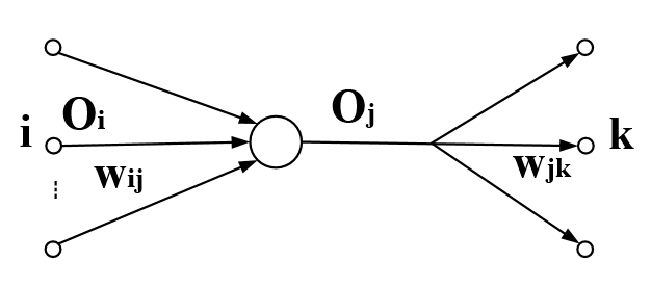
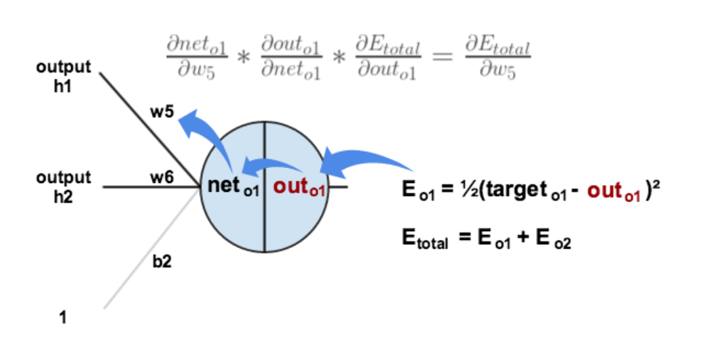
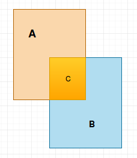
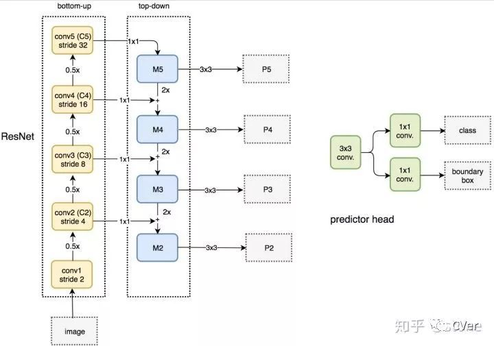
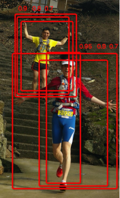
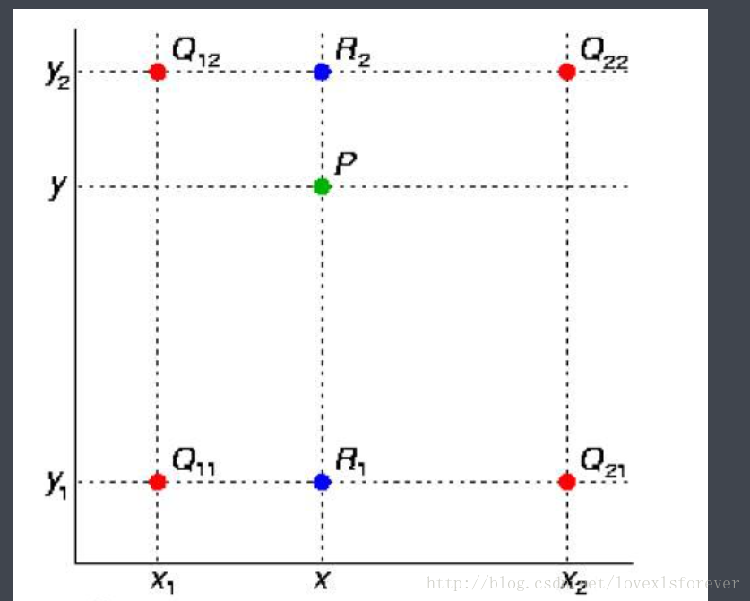
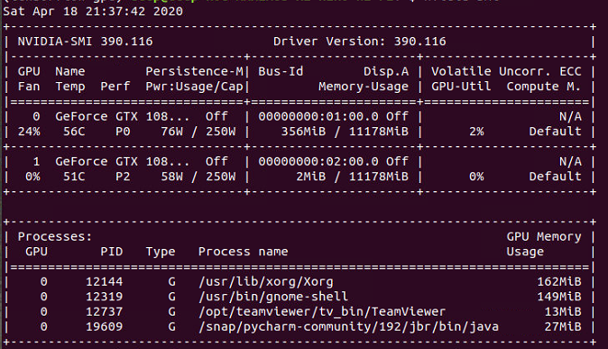
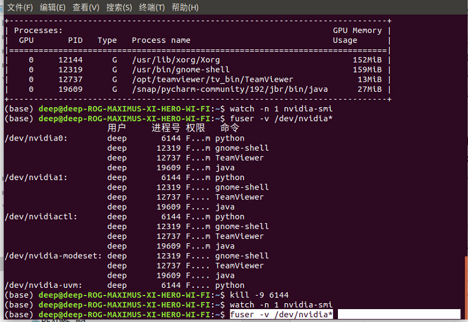

# MaskRCNN

## 基础知识：

### `梯度`：

高数知识，对于u = f(x,y,z)

梯度：grad u = {φu/φx, φu/φy, φu/φz}

实际就是对每个参数求偏导得到的一个向量。梯度的方向是这个函数上升最快的方向，其方向导数最大。

方向导数的求法：

对于固定点M<sub>0</sub>(x<sub>0</sub>,y<sub>0</sub>,z<sub>0</sub>) ，u 向任意一点M(x,y,z) 方向变化的速度。也可看做，M<sub>0</sub>向着M的切线 L 的方向。方向导数定义如下
$$
\frac{φu}{φl} = \frac{φu}{φx}cosα+\frac{φu}{φy}cosβ+\frac{φu}{φz}cosγ
$$
方向导数写成向量的形式就是：
$$
\frac{φu}{φl} = (\frac{φu}{φx},\frac{φu}{φy},\frac{φu}{φz})⋅(cosα,cosβ,cosγ)
$$


上式前半截那一堆偏导组成的向量是个常向量，固定了点M<sub>0</sub> 前半截就确定了。 后半截是切线 L 的单位方向向量。两个向量相乘等于
$$
\sqrt{(\frac{φu}{φx}^2 ,\frac{φu}{φy}^2,\frac{φu}{φz}^2)}·cosΘ
$$
Θ是前半截向量和后半截向量的夹角。由于后半截是单位向量，所以模为1，就没了。由此可见，夹角Θ为0的时候，也就是没有夹角，方向向量与前半截同向的时候，变化速度最大。


### `正向传播`：

对一个神经元，他接受与他相连的所有的神经元的输出与连接权重的乘加和，放入到自己的激励函数中得到输出值传递给下一层的神经元，重复如此操作。



正向传播公式对于图中的神经元，wij是第i层，第j个神经元与图中神经元的连接权重，Oi是上一层每个神经元的输出。设该神经元激励函数为sigmoid函数

该神经元向前传播输出的值Oj:
$$
O_j =sigmoid(\sum{O_iw_{ij}})
$$

$$

$$

### `反向传播`：

back propagate

改编自https://blog.csdn.net/weixin_38347387/article/details/82936585，原文写的更好。

对于如下网络


就是通过对误差的贡献，从输出层结果，不停计算每个节点对最终误差的贡献，得到该结点的误差值，在上一层与该结点相连的连接。

从局部开始看：



https://blog.csdn.net/henreash/article/details/102925892

1. 计算误差

   ​	所有输出节点的总误差target是每个输出节点的期望值，outpu<sub>i</sub>是该输出节点实际的输出
   $$
   E_{total} = E_{out1}+E_{out2} =∑\frac{1}{2}(target-output_i)^2
   $$
   公式中每个节点的误差前面的1/2是为了求偏导时消除指数2变成的系数。

2. 更新隐藏层到输出层的参数（w5,w6,w7,w8）

   以权重w5为例

   E<sub>total</sub> 是一个关于未知量output<sub>1</sub>，output<sub>2</sub>的函数，而与w5有关的output<sub>1</sub>计算如下
   $$
   output_1 = sigmoid(y_{h1}*w5+y_{h2}*w6+b_2)
   $$
   ​	我设net<sub>o1</sub>为sigmoid函数的输入：
   $$
   net_{o1}=y_{h1}*w5+y_{h2}*w6+b_2
   $$
   ​	采用梯度下降法，E<sub>total</sub> 实际是一个关于所有权重的参数，但是我们要修改隐藏层到输出层权重的，那么从输入层输出的数值保持向前传播时的值，即为一个常量。所以E<sub>total</sub> 就是关于w5 , w6, w7, w8的函数。 根据梯度的概念，E<sub>total</sub> 沿着梯度向量变化最快，怎么然他沿着呢，当然就是在这个向量上平移即 w5 w6 w7 w8 按照方向向量的比例加减。方向向量如下：
   $$
   \{\frac{φE_{total}}{φw_5},\frac{φE_{total}}{φw_6} ,\frac{φE_{total}}{φw_7},\frac{φE_{total}}{φw_8}\}
   $$
   也就是说w5等其他参数只要减去等比例的梯度，就能最快的收敛。(梯度下降公式)
   $$
   \{w5,w6,w7,w8 \}-α \{\frac{φE_{total}}{φw_5},\frac{φE_{total}}{φw_6} ,\frac{φE_{total}}{φw_7},\frac{φE_{total}}{φw_8}\}
   $$
   这个比例α 就是学习率（learning rate）,相减的过程就叫做惩罚。梯度向量中的每一个元素叫做局部梯度（自己起的名字，也可能真叫这个）

   w5的局部梯度求解(链式求导)：
   $$
   \frac{φE_{total}}{φw_5} =\frac{φE_{total}}{φoutput_1}*\frac{φoutput_1}{φnet_{o1}}*\frac{φnet_{o1}}{φw5}
   $$
   步步求偏导之后：
   $$
   \frac{φE_{total}}{φw_5} =-(target_{o1}-output_{o1})output_1(1-output_1)*y_{h1}
   $$
   

   令：
   $$
   δ_{o1} =\frac{φE_{total}}{φoutput_1}*\frac{φoutput_1}{φnet_{o1}} =-(target_{o1}-output_{o1})output_1(1-output_1)
   $$
   

   因此：
   $$
   \frac{φE_{total}}{φw_5} =δ_{o1}*y_{h1}
   $$
   

   

   3. 更新输入层到隐藏层的权重w1,w2,w3,w4。

      

      以w1 为例，h1节点的误差受到E<sub>o1</sub>和E<sub>o2</sub>

      因此公式组如下：其他步骤如上即可。
      $$
      \frac{φE_{total}}{φw1} = \frac{φE_{total}}{φoutput_{h1}} *\frac{φoutput_{h1}}{φnet_{h1}}*\frac{φnet_{h1}}{φw1}
      $$

      $$
      \frac{φE_{total}}{φoutput_{h1}} = \frac{φE_{out1}}{φoutput_{h1}}+\frac{φE_{out2}}{φoutput_{h1}}
      $$

      $$
      φoutput_{h1} = sigmoid[Σ(y_{input_1}*w1 + y_{input_2}*w2+b1)]
      $$

   $$
   net_{h1} =y_{input_1}*w1 + y_{input_2}*w2+b1
   $$

   

### `上采样`

使用卷积核采集比被采集图小的特征图，即缩小图片

### `下采样`

使用卷积核采集比被采集图大的特征图，即放大图片


### `IOU`

预测框或者ROI框与ground true 框的重合率


$$
IOU = \frac{A\bigcap B}{A+B-(A\bigcap B)}
$$


## maskRCNN原理

 是基于fasterRCNN的和ResNet-FPN的模型。在其上添加了mask和改进了fasterRCNN算法得到。在图像识别分割方面一度超越当时的state-of-the-art（当前最高水准）。

### ResNet-FPN部分

内容搬运自：

https://www.cnblogs.com/wangyong/p/10614898.html

https://cloud.tencent.com/developer/article/1441531

https://blog.csdn.net/lanran2/article/details/54376126 

FPN流程图：图示为扣来resNet50的流程图，resNet101差不多，MaskRCNN作者预置了这两个主干网络。也可使用其他的网络，具体更换需要重写resnet_graph()函数。



横向连接了三个部分，首先

第一部分上升箭头，每一个上升箭头，代表一次卷积操作，总共进行了五次卷积操作，每一个的尺寸都更小，每一次的卷积核都是3X3，一次的卷积步长分别是[2,4,8,16,32]，分别第一次卷积，第二次卷积...的步长。每一步得到如些的feature map(特征图)。似乎为了释放内存C1没有使用。1024*1024的原图

①C1：256\*256\*64表示特征图的大小为256*256，特征图的个数是64个

②C2：256\*256\*256表示特征图的大小为256*256，共有256个特征图

③C3：128\*128\*512表示特征图的大小为128*128，共有512个特征图

④C4：64\*64\*1024表示特征图的大小为64*64，共有1024个特征图

⑤C5：32\*32\*2048表示特征图的大小为32*32，共有2048个特征图

第二部分下降箭头（特征金字塔FPN的建立）。

1. 首先对C5进行1\*1（卷积，无激活）的卷积，卷积核256个得到新的feature map：32\*32\*256，记为P5
2. 将P5进行步长为2的上采样得到64\*64\*256的feature Map，再与C4经过的256个1\*1卷积核操作得到的结果相加（3\*3卷积消除混叠效应），得到64\*64\*256，记为P4
3. 将P4进行步长为2的上采样得到128\*128\*256，再与C3经过的256个1*1卷积核操作得到的结果相加，得到128*128*256，记为P3
4. 将P3进行步长为2的上采样得到256\*256\*256，再与C2经过的256个1*1卷积核操作得到的结果相加，得到256\*256\*256，记为P2
5. 将P5进行步长为2的最大池化操作得到：16\*16\*256，记为P6

每次相加融合之后都会进行3\*3卷积核对已经融合的特征进行卷积处理，用以消除混叠效应。

得到的[P2,P3,P4,P5,P6]（特征金字塔）作为FasterRCNN的输入。

P2:	256\*256\*256   stride=4 

P3:	128\*128\*256   stride=8

P4:	64\*64\*256		stride=16

P5:	32\*32\*256		stride= 32

P6:	16\*16\*256		stride=64

### fasterRCNN部分

  1. Conv layers(卷积)：上部分的特征金字塔的输入

  2. Region Proposal Networks(RPN操作)

        ​	RPN操作主要用来生成region proposal。RPN会根据scale在各个个金字塔层上生成region proposal。

        ​	scale 设置在config.py中：

        ```python
        RPN_ANCHOR_SCALES = (32, 64, 128, 256, 512)
        ```

        对应关系如下

        ​	P2:	256\*256\*256   stride=4 		scale =512

        ​	P3:	128\*128\*256   stride=8		 scale =256

        ​	P4:	64\*64\*256		stride=16	  scale =128

        ​	P5:	32\*32\*256		stride=32	  scale =64

        ​	P6:	16\*16\*256		stride=64	  scale =32

        ​	anchor框的生成，在特征图的每个点上生成面积为scale的框，该框的宽高经过三种比例变换，得到三种形状。这三个比例同样在config.py中设置。

        ```python
        RPN_ANCHOR_RATIOS = [0.5, 1, 2]
        ```

        每一层对应生成了：

        + 以P2层每个像素点位中心，对应到原图上，则可生成256\*256\*3(长宽三种变换)=196608个锚框

        + 以P3层每个像素点为中心，对应到原图上，则可生成128\*128\*3=49152个锚框

        + 以P4层每个像素点为中心，对应到原图上，则可生成64\*64\*3=12288个锚框

        + 以P5层每个像素点为中心，对应到原图上，则生成32\*32\*3=3072个锚框

        + 以P6层每个像素点为中心，对应到原图上，则生成16\*16\*3=768个锚框

  3. anchor分类和回归

        取出置信度前`pre_nms_top_n`的anchors；（eg `pre_nms_top_n=2000`）

        每个anchor再通过1×1的卷积核向前传播得到两个分数score（分别是前景和背景的得分）,根据分数的高低，取前2000个得分最高的框，此时才是真正的`ROI`.

        

        2000个ROI同样向前传播计算偏移量贴近ground truth，这一次向前得到4个坐标分别是[x,y,w,h]，x,y表示的是中心点，w,h 分别是宽高。

        4个坐标是指针对原图坐标的偏移，首先一定要记住是原图； 

        然后根据置信率做NMS(非极大抑制)

        

ROIs kept after non-maximum suppression (training and inference)

        POST_NMS_ROIS_TRAINING = 2000
        POST_NMS_ROIS_INFERENCE = 1000
        ```


​        

  4. 非极大抑制

        

        >如上图所示，一共有6个识别为人的框，每一个框有一个置信率。 
        >现在需要消除多余的:
        >
        >- 按置信率排序: 0.95, 0.9, 0.9, 0.8, 0.7, 0.7
        >- 取最大0.95的框为一个物体框
        >- 剩余5个框中，去掉与0.95框重叠率IoU大于0.6(可以另行设置)，则保留0.9, 0.8, 0.7三个框
        >- 重复上面的步骤，直到没有框了，0.9为一个框
        >- 选出来的为: 0.95, 0.9
        >
        >进行非最大值抑制的目的主要是需要剔除掉重复的框，如果经过非最大值抑制操作后得到的ROI没有事先代码中设定的2000个，则用0填充。

  5. DetectionTargetLayer上面2000个`ROI`  首先剔除0的。

        如果ROI与ground truth的IoU>0.5，标记为正样本

        如果ROI与ground truth的IoU<0.5，标记为负样本

        正样本保留200个，负样本保留正样本的3倍，正样本数量有config.py中的规定

        ```python
        # Number of ROIs per image to feed to classifier/mask heads
        # The Mask RCNN paper uses 512 but often the RPN doesn't generate
        # enough positive proposals to fill this and keep a positive:negative
        # ratio of 1:3. You can increase the number of proposals by adjusting
        # the RPN NMS threshold.
        TRAIN_ROIS_PER_IMAGE = 200
        ```

        1. 对于每个正样本，进一步计算与其相交最大即最接近的真实框ground truth box，将这个真实框所对应的类别即class_id赋予这个正样本，这样RCNN网络就可以区分具体哪个类别

           

        2. 同样，计算每个正样本ROI与最接近的真实框ground truth box之间的<b>偏移量</b>

           

        3. RCNN网络还需要保存与每个正样本`ROI`最接近的真实框ground truth box的mask掩码信息，并且知道每个mask大小为参数`MASK_SHAPE`所指定

           ```python
           # Shape of output mask
           # To change this you also need to change the neural network mask branch
           MASK_SHAPE = [28, 28]
           ```

           一般为28*28，同时知道其所属于的类别即class_id，进行保存。

        4. 后DetectionTargetLayer层返回800个正、负样本，800个位移偏移量（其中600个负样本由0填充），800个掩码mask信息（其中600个由0填充)

  6. RoI pooling

         	+  最大池化。

  7. RoI Align

     在原图找到800个ROI，这些`ROI`是在各个特征层经过偏移产生的。现在需要把它映射回原图上去。

     首先需要找到每个ROI对应的特征层，映射函数如下
     $$
     k = [k_o+log_2(\sqrt{w/h}÷224)]
     $$
     其中w，h分别对应`ROI`宽度和高度;k是这个ROI应属于的特征层（P2~P6）;k<sub>0</sub> 是w,h=224,224时映射的特征层，取值为4，即对应着P4，使用224是因imageNet的标准图片大小。

     

     开始确定`ROI`在特征图上的图片大小。用每个ROI的长宽，除以其对应层的步长得到实际在特征图上的大小

     >使用每个ROI的长、宽除以步长，得到ROI映射到特征图上的图片大小，比如ROI为113\*113，对应P3层，步长为8，则在特征图上的感兴趣区域则为14.13*14.13

     

     `roi `区域需要resize成统一的大小，这里用的尺寸应该是7\*7,则需要将14.13\*14.13这个区域分成49份，每一份的大小为：2.02\*2.02

     

     再将每个2.02\*2.02的小区域,平均分成四份，取每一份中心点的位置，<b>使用双线性插值法</b>计算四个中心点像素的值，然后取四个区域的最大值作为该2.02\*2.02区域的像素值。如此就得到了7\*7大小的feature Map。

     + 双线值插值法: 

       就是两次两点法求直线，然后带入上面算出的浮点数的点。因为比较简单直接复制自

       [https://blog.csdn.net/qq_37577735/article/details/80041586#%E5%8F%8C%E7%BA%BF%E6%80%A7%E6%8F%92%E5%80%BC%E6%B3%95](https://blog.csdn.net/qq_37577735/article/details/80041586#双线性插值法)

       

       求P点值，首先根据Q12 Q22,的值得到一条直线，把P的x坐标带入算出得到R2的值

       同样的得到R1的值，在根据R1，R2的值得到一条直线函数，然后计算P的点值。

     


## 报错信息:

### 测试图片路径是否正确

```shell
xdg-open ***.png
```

打开图片指令


### TypeError

```python
The above exception was the direct cause of the following exception:

Traceback (most recent call last):
  File "/home/deep/maskRcnn/Mask-Rcnn-master/samples/city/citytarinning.py", line 234, in <module>
    train(model)
  File "/home/deep/maskRcnn/Mask-Rcnn-master/samples/city/citytarinning.py", line 199, in train
    layers='heads')  #
  File "/home/deep/maskRcnn/Mask-Rcnn-master/mrcnn/model.py", line 2374, in train
    use_multiprocessing=True,
  File "/home/deep/.local/lib/python3.6/site-packages/keras/legacy/interfaces.py", line 91, in wrapper
    return func(*args, **kwargs)
  File "/home/deep/.local/lib/python3.6/site-packages/keras/engine/training.py", line 1418, in fit_generator
    initial_epoch=initial_epoch)
  File "/home/deep/.local/lib/python3.6/site-packages/keras/engine/training_generator.py", line 181, in fit_generator
    generator_output = next(output_generator)
  File "/home/deep/.local/lib/python3.6/site-packages/keras/utils/data_utils.py", line 709, in get
    six.reraise(*sys.exc_info())
  File "/home/deep/.local/lib/python3.6/site-packages/six.py", line 693, in reraise
    raise value
  File "/home/deep/.local/lib/python3.6/site-packages/keras/utils/data_utils.py", line 685, in get
    inputs = self.queue.get(block=True).get()
  File "/home/deep/anaconda3/envs/tensorflow-gpu/lib/python3.6/multiprocessing/pool.py", line 644, in get
    raise self._value
TypeError: only integer scalar arrays can be converted to a scalar index
ERROR:root:Error processing image {'id': 'bremen_000194_000019_gtFine_instanceIds.png', 'source': 'city', 'path': '/media/deep/新加卷/data-soft/cityscapes/leftImg8bit/train/bremen/bremen_000194_000019_leftImg8bit.png', 'width': 2048, 'height': 1024, 'mask_path': '/media/deep/新加卷/data-soft/cityscapes/gtFine/train/bremen/bremen_000194_000019_gtFine_instanceIds.png', 'num_objs': 20, 'obj_ids': array([    6,     7,     8,    11,    17,    19,    20,    21,    23,
          24,    26, 24000, 24001, 26000, 26001, 26002, 26003, 26004,
       26005, 26006, 26007], dtype=uint16)}
Traceback (most recent call last):
  File "/home/deep/maskRcnn/Mask-Rcnn-master/mrcnn/model.py", line 1709, in data_generator
    use_mini_mask=config.USE_MINI_MASK)
  File "/home/deep/maskRcnn/Mask-Rcnn-master/mrcnn/model.py", line 1265, in load_image_gt
    class_ids = class_ids[_idx]
TypeError: only integer scalar arrays can be converted to a scalar index

Process finished with exit code 1
```


maskRCNN通篇的数据结构均是np数组，爆出此错误时我在load_mask 中返回的class_id使用了一般的array类型。

nparray 和 array 在打印的时候表现也不一样:

```
[1, 2, 3, 4] <class 'list'>
[1 2 3 4] <class 'numpy.ndarray'>
```


### ResourceExhaustedError

>ResourceExhaustedError: OOM when allocating tensor with shape[1,128,256,256] and type float ……

gpu不足，使用 

```shell
nvidia-smi
```

```
watch -n 0.1 -d nvidia-smi
```

0.1秒刷新一次


查看GPU的使用



`Memory-Usage`一栏里的数值是：已用显存大小/可用显存大小

`volatile Uncorr. ECC GPU-Util compute M.` 一栏显示的GPU利用率

GPU不足一般要杀死一些进程。如果`nvidia-smi`中没有显示占用的话使用`fuser -v /dev/nvidia*`查看所有进程



杀死`/dev/nvidia0` 中的某些进程，在上图我们要杀死6144号进程。


### MemoryError

```python
Unable to allocate array with shape (XX, XX, XX) and data type float64
```

这个错误报在load_mask 中，说的是创建的mask数组占用的内存过大无法创建(每个数字占用64位)，将创建时使用的类型改成int8(每个数字占用8位).

爆出该错误的原因是（节选自解决方案https://blog.csdn.net/Ryxiong728/article/details/105016093/）：

据传 [1] 是因为触发了系统的 overcommit handing 模式。

事情是这样的，我打算生成一个形状为[430949, 430949]的稀疏矩阵，结果就报了上述错误。大致是因为这个矩阵似乎要占用的空间太大，所以系统就提前禁止创建了。


### ValueError

```
Traceback (most recent call last):
 
  File "<ipython-input-1-fdee81fb82fb>", line 1, in <module>
    runfile('G:/labelme/test.py', wdir='G:/labelme')
 
  File "C:\Users\34905\Anaconda3\envs\cv2\lib\site-packages\spyder_kernels\customize\spydercustomize.py", line 704, in runfile
    execfile(filename, namespace)
 
  File "C:\Users\34905\Anaconda3\envs\cv2\lib\site-packages\spyder_kernels\customize\spydercustomize.py", line 108, in execfile
    exec(compile(f.read(), filename, 'exec'), namespace)
 
  File "G:/labelme/test.py", line 48, in <module>
    model.load_weights(COCO_MODEL_PATH, by_name=True)
 
  File "G:\Mask_RCNN\mrcnn\model.py", line 2131, in load_weights
    saving.load_weights_from_hdf5_group_by_name(f, layers)
 
  File "C:\Users\34905\Anaconda3\envs\cv2\lib\site-packages\keras\engine\saving.py", line 1149, in load_weights_from_hdf5_group_by_name
    str(weight_values[i].shape) + '.')
 
ValueError: Layer #389 (named "mrcnn_bbox_fc"), weight <tf.Variable 'mrcnn_bbox_fc/kernel:0' shape=(1024, 8) dtype=float32_ref> has shape (1024, 8), but the saved weight has shape (1024, 324).

```

如果你不想测试coco里默认的81类，只想测试2类，那一定记住要把model.load_weights(COCO_MODEL_PATH, by_name=True)改为model.load_weights(COCO_MODEL_PATH, by_name=True, exclude=["mrcnn_class_logits", "mrcnn_bbox_fc","mrcnn_bbox", "mrcnn_mask"])
————————————————
版权声明：本文为CSDN博主「唤醒沉睡的你」的原创文章，遵循 CC 4.0 BY-SA 版权协议，转载请附上原文出处链接及本声明。
原文链接：https://blog.csdn.net/qq_16065939/article/details/84769397


```python


Traceback (most recent call last):

  File "<ipython-input-10-4a900268c3f6>", line 1, in <module>
    runfile('D:/Mask R-CNN/train.py', wdir='D:/Mask R-CNN')

  File "D:\Anaconda3\Anaconda3-5.3.0\envs\cv2\lib\site-packages\spyder_kernels\customize\spydercustomize.py", line 704, in runfile
    execfile(filename, namespace)

  File "D:\Anaconda3\Anaconda3-5.3.0\envs\cv2\lib\site-packages\spyder_kernels\customize\spydercustomize.py", line 108, in execfile
    exec(compile(f.read(), filename, 'exec'), namespace)

  File "D:/Mask R-CNN/train.py", line 158, in <module>
    model.load_weights(COCO_MODEL_PATH, by_name=True,exclude=["mrcnn_class_logits", "mrcnn_bbox_fc","mrcnn_bbox", "mrcnn_mask"])

  File "D:\Mask R-CNN\mrcnn\model.py", line 2131, in load_weights
    saving.load_weights_from_hdf5_group_by_name(f, layers)

  File "D:\Anaconda3\Anaconda3-5.3.0\envs\cv2\lib\site-packages\keras\engine\saving.py", line 1104, in load_weights_from_hdf5_group_by_name
    g = f[name]

  File "h5py\_objects.pyx", line 54, in h5py._objects.with_phil.wrapper

  File "h5py\_objects.pyx", line 55, in h5py._objects.with_phil.wrapper

  File "D:\Anaconda3\Anaconda3-5.3.0\envs\cv2\lib\site-packages\h5py\_hl\group.py", line 177, in __getitem__
    oid = h5o.open(self.id, self._e(name), lapl=self._lapl)

  File "h5py\_objects.pyx", line 54, in h5py._objects.with_phil.wrapper

  File "h5py\_objects.pyx", line 55, in h5py._objects.with_phil.wrapper

  File "h5py\h5o.pyx", line 190, in h5py.h5o.open

KeyError: 'Unable to open object (wrong B-tree signature)'
```


这个bug是我目前遇到最难察觉问题的bug，而且网上关于这个bug的解决方法很少，经过我仔细的排查，我发现是我的mask_rcnn_coco.h5文件有问题。我重新下载后，就解决了这个bug，建议大家在重新搭建平台的时候，不要用上一个平台已经用过的预权重 mask_rcnn_coco.h5，会发生很多不可知的错误。最好还是重新去网上下载一个。
————————————————
版权声明：本文为CSDN博主「唤醒沉睡的你」的原创文章，遵循 CC 4.0 BY-SA 版权协议，转载请附上原文出处链接及本声明。
原文链接：https://blog.csdn.net/qq_16065939/article/details/84769397


### AttributeError: 

```
AttributeError:'NoneType' object has no attribute 'terminate'
```

线程的原因，在这个错误上面肯定有一个关于线程创建的错误，如果最后输出的程序状态没有异常（状态码：0）可以不用理会。


### OSError

```python
OSError: [Errno 12] Cannot allocate memory
```

无法分配内存，内存被沾满了，可以尝试减小batch_size。或者监控内存使用情况分析原因

```shell
watch -n 2 free -m
```


### ValueError

```python
ValueError: Error when checking input: expected input_image_meta to have shape (46,) but got array with shape (45,)
```

class_num的值写的不对。


```python
setting an array element with a sequence.
```


###  Check failed

```python
2020-05-01 04:53:19.086148: F ./tensorflow/core/util/cuda_launch_config.h:127] Check failed: work_element_count > 0 (0 vs. 0)
```

1. 类别Id的最大值不能超过识别类别的总数量，也就是Id要从1开始编号。
2. mask生成了一个0层的。


### IndexError

```python
IndexError: boolean index did not match indexed array along dimension 0; dimension is 11 but corresponding boolean dimension is 13
```

mask层数与返回的class_id数量不一致


### 监控CPU和内存

```shell
htop free
```


### 查看cpu信息

```
cat /proc/cpuinfo
```


## 多线程模型改成单线程模型：

遇到这个问题大家不要慌，这是因为大家设置了多线程，但是线程不同步造成的。大家耐心等一会，就会出现loss了。同时如果大家不希望出现多线程，大家可以改为单线程。更改方法如下：在Mask RCNN\mrcnn\model.py中

```python
self.keras_model.fit_generator(
    train_generator,
    initial_epoch=self.epoch,
    epochs=epochs,
    steps_per_epoch=self.config.STEPS_PER_EPOCH,
    callbacks=callbacks,
    validation_data=val_generator,
    validation_steps=self.config.VALIDATION_STEPS,
    max_queue_size=100,
    workers=workers,
    use_multiprocessing=True,
    # use_multiprocessing=False,
)
```


大家如果只是想要把多线程改为单线程，就要把use_multiprocessing=False,同时要让workers=1。因为单线程的情况下让workers大于1会报错！
————————————————
版权声明：本文为CSDN博主「唤醒沉睡的你」的原创文章，遵循 CC 4.0 BY-SA 版权协议，转载请附上原文出处链接及本声明。
原文链接：https://blog.csdn.net/qq_16065939/article/details/84769397


## 模型特征金字塔使用层数：

```python

model.train(dataset_train, dataset_val,learning_rate=config.LEARNING_RATE,epochs=20,layers='heads')
 
model.train(dataset_train, dataset_val,learning_rate=config.LEARNING_RATE / 10,epochs=20,layers="all")
#model.train(dataset_train, dataset_val,learning_rate=config.LEARNING_RATE / 10,epochs=1,layers="all")
```

layers取值：

heads:使用特征金字塔头部训练

3+：使用特征金字塔第三层网上

4+：使用特征金字塔第四层网上

all：使用所有特征金字塔

